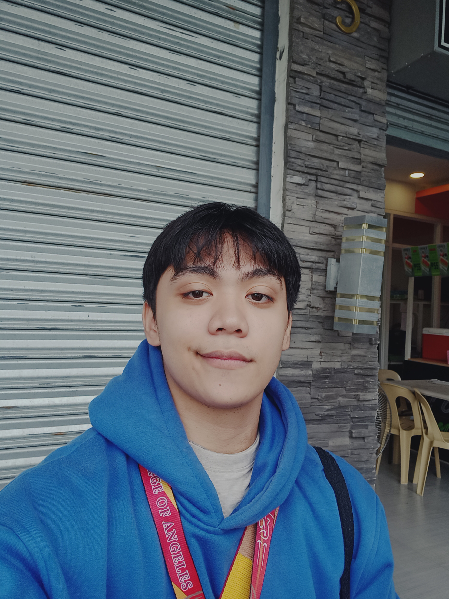

# 7OOP-Laboratory-Projects-
This repository will contain my collection of Python OOP activities.

---

## 🙋‍♂️ ABOUT ME 

  

👋 Hi, I'm ANDREW SEAN D. ARCILLA, a college student currently studying computer science at my 2nd year. Even if struggling, I continue to try what I can do to give my best on the challenges I face in life. Hopefully, I can be the person I've always wanted to become and make my past self proud on what I've achieved.

## 🌐 Area of Interest and Programming Language
**🎯 Area of Interest**
- Application Development 📱
- Game Development 🎮
- Machine Learning 🤖

**Programming Languages** 

  
  
  

## 🛠️ Projects

### 📘 Midterms
- [Paired Task 1: Object Oriented Analysis](https://github.com/Andrew-Arcilla/7OOP-Laboratory-Projects-/blob/main/PairedtaskObjectOrientedAnalysis.pdf)
- [Lab Task 1](https://github.com/Andrew-Arcilla/7OOP-Laboratory-Projects-/blob/main/MidtermLabTask1.pdf)  
- [Lab Task 2: Using Loops and Functions](https://github.com/Andrew-Arcilla/7OOP-Laboratory-Projects-/blob/main/MidtermLabTask2.pdf)  
- [Lab Task 3: Using List and Collection Types](https://github.com/Andrew-Arcilla/7OOP-Laboratory-Projects-/blob/main/MidtermLabTask3.pdf)
- [Lab Task 4: Using Dictionaries](https://github.com/Andrew-Arcilla/7OOP-Laboratory-Projects-/blob/main/MidtermLabTask4.pdf)
- [Lab Task 5](https://github.com/Andrew-Arcilla/7OOP-Laboratory-Projects-/blob/main/MidtermLabTask5.pdf)

### 🎓 Finals
- [Project 1 ](#)  
- [Project 2 ](#)  

## 😎 Fun Facts About Me
- 🎧 I love listening to music while I'm doing something 
- 🌃 Staring at night sky helps me calm
- ✍️ I try to express what I feel through sketches and drawings
- 💭 I enjoy reading comics

## 📞 Contact Me  

  

